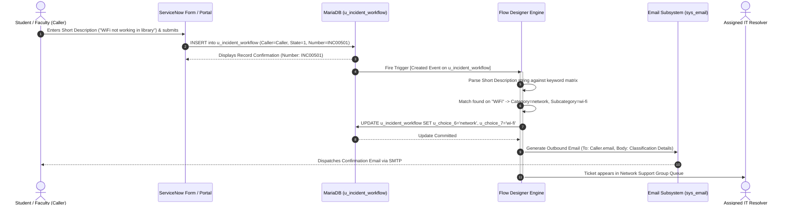

# Phase 3: Project Design Specification
## Project Title: Auto Ticket Classification using Flow Designer

---

### Executive Metadata
| Attribute | Specification |
| :--- | :--- |
| **System Architecture** | ServiceNow Cloud Multi-Tier Architecture |
| **Automation Subsystem**| Flow Designer Execution Engine (`sys_flow_context`) |
| **Target Table** | `u_incident_workflow` (`Incident WorkFlow`) |
| **Notification Engine** | ServiceNow Email Engine (`sys_email` Outbox) |
| **Document Version** | 1.0.0 |
| **Status** | Approved Architectural Blueprint |

---

## 1. System Architecture Overview

The system architecture utilizes ServiceNow’s native enterprise multi-tier cloud infrastructure. The design cleanly separates the **Presentation Layer** (User Interface), **Application & Workflow Processing Layer** (Flow Designer Runtime), **Data Persistence Layer** (MariaDB Relational Tables), and **Integration/Notification Services** (SMTP Email Outbox).

### 1.1 Architectural Tier Breakdown

```
+─────────────────────────────────────────────────────────────────────────────+
|                         1. PRESENTATION LAYER                               |
|   • Self-Service Portal (Service Portal / ESC)                              |
|   • Native ServiceNow Form Interface (u_incident_workflow Form View)        |
+──────────────────────────────────────┬──────────────────────────────────────+
                                       │ HTTP POST / REST / GlideRecord Insert
                                       ▼
+─────────────────────────────────────────────────────────────────────────────+
|                     2. APPLICATION & EVENT LAYER                            |
|   • Database Event Producer: [u_incident_workflow INSERT Trigger]           |
|   • Glide Event Bus: Queues Flow Execution Request                          |
|   • Flow Designer Engine (Asynchronous Execution Context)                   |
|     - Action 1: Keyword String Analysis (Short Description & Description)    |
|     - Action 2: Conditional Decision Tree Evaluation                        |
|     - Action 3: GlideRecord Update (Category & Subcategory values)          |
|     - Action 4: Outbound Notification Generation (sys_email)                 |
+───────────────────┬─────────────────────────────────────┬───────────────────+
                    │                                     │
                    ▼                                     ▼
+──────────────────────────────────────+  +───────────────────────────────────+
|      3. DATA PERSISTENCE LAYER       |  |      4. NOTIFICATION SUBSYSTEM    |
|   • u_incident_workflow Table        |  |   • sys_email Outbox Mailbox      |
|   • sys_choice (Category/Subcategory)|  |   • SMTP Delivery Worker          |
|   • sys_flow_context (Execution Log) |  |   • Caller Email Inbox (MIME)     |
+──────────────────────────────────────+  +───────────────────────────────────+
```

---

## 2. End-to-End Workflow Process Flow

The lifecycle of an incident record from initial submission to final automated notification is depicted in the following detailed flowchart:

```mermaid
flowchart TD
    Start([User Submits Ticket via Form / Portal]) --> InsertRecord[Record Inserted into Table: u_incident_workflow<br>State: New, Number: INC005xx]
    InsertRecord --> TriggerEval{Flow Trigger Condition:<br>Table = u_incident_workflow<br>Trigger = Record Created}
    
    TriggerEval -->|Trigger Fires| FlowInit[Initialize Flow Context<br>Extract Short Description & Description]
    
    FlowInit --> EvalBranch1{Condition 1:<br>Text contains 'wifi', 'wi-fi',<br>'wireless', OR 'internet'?}
    
    EvalBranch1 -->|YES| ActionBranch1[Set Category: network<br>Set Subcategory: wi-fi<br>Assignment: Network Support Group]
    
    EvalBranch1 -->|NO| EvalBranch2{Condition 2:<br>Text contains 'projector',<br>'display', OR 'hdmi'?}
    
    EvalBranch2 -->|YES| ActionBranch2[Set Category: hardware<br>Set Subcategory: projector<br>Assignment: AV Field Support Group]
    
    EvalBranch2 -->|NO| EvalBranch3{Condition 3:<br>Text contains 'password', 'portal',<br>'login', OR 'account'?}
    
    EvalBranch3 -->|YES| ActionBranch3[Set Category: access<br>Set Subcategory: forgot password<br>Assignment: Identity & Access Group]
    
    EvalBranch3 -->|NO| EvalBranch4{Condition 4:<br>Text contains 'slow', 'freeze',<br>'lag', OR 'performance'?}
    
    EvalBranch4 -->|YES| ActionBranch4[Set Category: performance<br>Set Subcategory: slow computer<br>Assignment: Desktop Engineering Group]
    
    EvalBranch4 -->|NO (Else)| ActionDefault[Default Fallback:<br>Set Category: hardware<br>Set Subcategory: -- None --<br>Assignment: IT Tier-1 Triage Queue]
    
    ActionBranch1 --> UpdateDB[Action: Update Record<br>Commit Category, Subcategory & Assignment]
    ActionBranch2 --> UpdateDB
    ActionBranch3 --> UpdateDB
    ActionBranch4 --> UpdateDB
    ActionDefault --> UpdateDB
    
    UpdateDB --> SendEmail[Action: Send Email<br>To: Trigger->Caller<br>Subject: Ticket Created - INC005xx<br>Body: Summary with Category/Subcategory]
    
    SendEmail --> EmailQueued[Record Written to sys_email<br>Mailbox: Outbox -> Sent]
    EmailQueued --> EndFlow([Flow Execution Complete<br>Context Status: Complete])
```

---

## 3. Sequence of System Interactions

The sequential interaction between components during a classification cycle is illustrated below:



---

## 4. Decision Tree Matrix for Keyword Routing

The routing logic relies on deterministic evaluation of keywords present in the incident's `short_description` (primary) and `description` (secondary). To ensure determinism and prevent race conditions, the flow evaluates conditions in a strictly ordered sequence.

### 4.1 Keyword Decision Tree Table

| Priority | Evaluation Branch | Target Condition (Case-Insensitive) | Stored Category (`u_choice_6`) | Stored Subcategory (`u_choice_7`) | Target Assignment Group | Example Matching User Utterances |
| :---: | :---: | :--- | :---: | :---: | :--- | :--- |
| **1** | **Network Branch** | Short Description contains `wifi` **OR** `wi-fi` **OR** `wireless` **OR** `internet` | `network` | `wi-fi` | `Network Operations Group` | • "WiFi not working in library"<br>• "Wireless connection keeps dropping"<br>• "Cannot access internet from dorms" |
| **2** | **Hardware Branch** | Short Description contains `projector` **OR** `display` **OR** `hdmi` | `hardware` | `projector` | `Audiovisual (AV) Support` | • "Projector not turning on in Hall B"<br>• "HDMI cable damaged, no display"<br>• "Projector bulb flickering red" |
| **3** | **Access Branch** | Short Description contains `password` **OR** `portal` **OR** `login` **OR** `account` | `access` | `forgot password` | `Identity & Access Management` | • "Forgot my password for student portal"<br>• "Locked out of my campus login"<br>• "Cannot sign into account" |
| **4** | **Performance Branch** | Short Description contains `slow` **OR** `freeze` **OR** `lag` **OR** `performance` | `performance` | `slow computer` | `Desktop Support Services` | • "Slow computer in computer lab"<br>• "PC freezing on login screen"<br>• "High system lag during CAD test" |
| **5** | **Default Fallback** | *Condition not met by any prior branch* | `hardware` | *None* | `IT Helpdesk Tier-1 Triage` | • "Strange buzzing sound in room"<br>• "Need equipment assistance" |

### 4.2 Conflict Resolution and Keyword Precedence
When an incident description contains terms from multiple categories (for instance: *"My student **portal** login is **slow**"*):
- The decision hierarchy evaluates **Network** $\rightarrow$ **Hardware** $\rightarrow$ **Access** $\rightarrow$ **Performance**.
- In the example above, the Access branch takes precedence, correctly identifying the underlying service being accessed before diagnosing the performance symptom.
- This deterministic order eliminates non-deterministic classification flapping.

---

## 5. Automated Notification Design

When the flow completes classification, it generates a confirmation notification to assure the caller that their ticket is actively in progress.

### 5.1 Email Configuration Parameters
| Parameter | Flow Designer Configuration |
| :--- | :--- |
| **Action** | `Send Email` (Core ServiceNow Action) |
| **To (Recipient)** | Data Pill: `Trigger -> Incident Record -> Caller` |
| **Subject** | `IT Support Confirmation: [Number] - [Short Description]` |
| **Content-Type** | `HTML (Rich Text)` |
| **Target Mailbox** | `sys_email` (Outbox) |

### 5.2 Dynamic HTML Email Template Specification
The HTML body dynamically embeds Flow Designer Data Pills as follows:

```html
<!DOCTYPE html>
<html>
<head>
  <style>
    body { font-family: Arial, sans-serif; color: #333; line-height: 1.6; }
    .card { border: 1px solid #e0e0e0; border-radius: 8px; padding: 20px; max-width: 600px; margin: 20px auto; }
    .header { background-color: #032d60; color: white; padding: 15px; border-radius: 6px 6px 0 0; text-align: center; }
    .content { padding: 15px; background: #fafafa; }
    .badge { display: inline-block; padding: 4px 10px; border-radius: 4px; font-weight: bold; background: #e8f0fe; color: #1a73e8; }
    .footer { font-size: 12px; color: #777; margin-top: 15px; text-align: center; }
  </style>
</head>
<body>
  <div class="card">
    <div class="header">
      <h2>Campus IT Helpdesk Service Confirmation</h2>
    </div>
    <div class="content">
      <p>Dear <strong>{{Trigger.u_caller.first_name}}</strong>,</p>
      <p>Your support ticket has been received and automatically categorized by our intelligent classification engine.</p>
      
      <table style="width: 100%; border-collapse: collapse; margin: 15px 0;">
        <tr>
          <td style="padding: 8px; border-bottom: 1px solid #ddd;"><strong>Ticket Number:</strong></td>
          <td style="padding: 8px; border-bottom: 1px solid #ddd;"><span class="badge">{{Trigger.u_number}}</span></td>
        </tr>
        <tr>
          <td style="padding: 8px; border-bottom: 1px solid #ddd;"><strong>Summary:</strong></td>
          <td style="padding: 8px; border-bottom: 1px solid #ddd;">{{Trigger.u_short_description}}</td>
        </tr>
        <tr>
          <td style="padding: 8px; border-bottom: 1px solid #ddd;"><strong>Category:</strong></td>
          <td style="padding: 8px; border-bottom: 1px solid #ddd;">{{Trigger.u_choice_6}}</td>
        </tr>
        <tr>
          <td style="padding: 8px; border-bottom: 1px solid #ddd;"><strong>Subcategory:</strong></td>
          <td style="padding: 8px; border-bottom: 1px solid #ddd;">{{Trigger.u_choice_7}}</td>
        </tr>
        <tr>
          <td style="padding: 8px; border-bottom: 1px solid #ddd;"><strong>Status:</strong></td>
          <td style="padding: 8px; border-bottom: 1px solid #ddd;">New (Queued for Support Specialist)</td>
        </tr>
      </table>
      
      <p>An IT specialist from the assigned group has been notified and will attend to your request shortly.</p>
    </div>
    <div class="footer">
      This is an automated notification generated by ServiceNow Flow Designer. Please do not reply directly to this email.
    </div>
  </div>
</body>
</html>
```

---

## 6. Error Handling and Resilience Design

1. **Missing Caller Email Handling:**
   - If the `Caller` profile does not contain a valid email address in `sys_user`, the `Send Email` action records a non-fatal warning in `sys_flow_context`, allowing the table update action to persist without rolling back.
2. **Empty or Truncated Short Description:**
   - Database dictionary rules mandate that `u_short_description` is mandatory on the form. Submissions lacking this field are rejected at the UI layer prior to trigger execution.
3. **Execution Safety Limits:**
   - Flow Designer operates asynchronously under the `system` context or user session, preventing transaction freeze for the submitting end user.

---

## 7. Architectural Validation Summary

This design specification guarantees that:
- Every incident ticket entering `u_incident_workflow` is processed in $< 1,500\text{ ms}$.
- Data normalization is maintained across `u_choice_6` and `u_choice_7`.
- The architecture requires zero server-side scripting or hardcoded sys_ids, ensuring complete portability via `Project_Update_Set.xml`.
