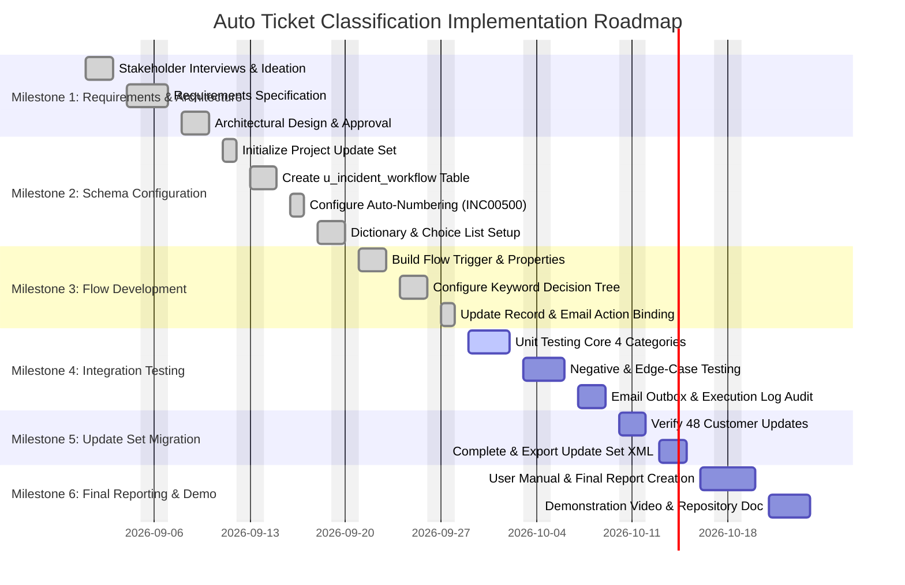

# Phase 4: Project Management and Execution Plan
## Project Title: Auto Ticket Classification using Flow Designer

---

### Executive Metadata
| Attribute | Specification |
| :--- | :--- |
| **Project Methodology** | Agile-Waterfall Hybrid (Iterative Development with Formal Phase Gates) |
| **Total Duration** | 6 Weeks (Standard Enterprise / Internship Capstone Timeline) |
| **Target Milestone Count**| 6 Distinct Production Milestones |
| **Baseline Update Set** | `Project Update Set` |
| **Document Version** | 1.0.0 |
| **Status** | Approved Project Plan |

---

## 1. Project Management Approach

The implementation of **Auto Ticket Classification using Flow Designer** follows a structured six-milestone project lifecycle. This hybrid delivery model combines the rigor of formal phase-gate sign-offs (for requirements, schema configuration, and release readiness) with the agility of rapid prototyping inside the ServiceNow developer instance.

---

## 2. Work Breakdown Structure (WBS)

The complete scope of work is segmented into 6 core milestones and 24 granular work packages:

```
1.0 Auto Ticket Classification using Flow Designer
│
├── 1.0 Milestone 1: Requirements Gathering & Architectural Scoping
│   ├── 1.1 Stakeholder Interviews (Helpdesk Tier-1, Faculty, System Admins)
│   ├── 1.2 Historical Incident Pattern Analysis & Taxonomy Identification
│   ├── 1.3 Feasibility Evaluation (Business Rules vs. Flow Designer)
│   └── 1.4 Baseline Approval of Functional & Non-Functional Requirements
│
├── 2.0 Milestone 2: ServiceNow Table & Dictionary Schema Configuration
│   ├── 2.1 Update Set Initialization (`Project Update Set` in Global scope)
│   ├── 2.2 Table Provisioning (`Incident WorkFlow` - `u_incident_workflow`)
│   ├── 2.3 Auto-Numbering Setup (Prefix: `INC`, Number: `500`, Digits: `5`)
│   └── 2.4 Dictionary Entries & Dependent Choice Binding (`u_choice_6` & `u_choice_7`)
│
├── 3.0 Milestone 3: Flow Designer Pipeline Construction & Email Automation
│   ├── 3.1 Flow Designer Definition & Database Trigger Configuration (`Created`)
│   ├── 3.2 Decision Tree Conditional Branches (Network, Hardware, Access, Performance)
│   ├── 3.3 Record Update Action Binding (`Update Record` with Category & Subcategory)
│   └── 3.4 Outbound Email Action Setup (`Send Email` with Dynamic HTML Data Pills)
│
├── 4.0 Milestone 4: System Integration & Edge-Case Testing
│   ├── 4.1 Unit Test Execution across 4 Core Incident Categories
│   ├── 4.2 Negative & Ambiguous Keyword Conflict Testing
│   ├── 4.3 Email Subsystem Verification (`sys_email` Outbox & Delivery Headers)
│   └── 4.4 Flow Execution Context Profiling (`sys_flow_context` Latency Audit)
│
├── 5.0 Milestone 5: Update Set Migration & Packaging
│   ├── 5.1 Verification of Customer Updates (48 Changes Captured)
│   ├── 5.2 Resolution of Update Set Collisions and Scope Checks
│   ├── 5.3 State Transition to `Complete`
│   └── 5.4 Export to XML (`Project_Update_Set.xml`)
│
└── 6.0 Milestone 6: Documentation, Final Reporting & Demonstration Walkthrough
    ├── 6.1 Authoring Comprehensive User Manual (End-User & Helpdesk Admin)
    ├── 6.2 Compilation of Final Project Report & Scalability Roadmap
    ├── 6.3 Demonstration Script & Presentation Guideline Formulation
    └── 6.4 Repository Baselining & Formal Academic/Stakeholder Review
```

---

## 3. Milestone Timeline and Gantt Chart

The delivery timeline spans 6 weeks, structured sequentially with clear dependencies between configuration, flow development, and testing phases.

### 3.1 Milestone Delivery Schedule

| Milestone | Title | Duration | Predecessor | Primary Owner | Key Deliverable |
| :---: | :--- | :---: | :---: | :--- | :--- |
| **M1** | Requirements & Architecture | Week 1 | None | Solution Architect | `Brainstorming_Document.md`, `Requirement_Analysis.md` |
| **M2** | Schema & Dictionary Setup | Week 2 | M1 | ServiceNow Developer | `u_incident_workflow`, `u_choice_6`, `u_choice_7` choices |
| **M3** | Flow Designer Construction | Week 3 | M2 | ServiceNow Developer | Active Flow: `Auto Ticket Classifier` |
| **M4** | Integration & QA Testing | Week 4 | M3 | QA Test Engineer | `Test_Cases_and_Results.md`, `sys_email` verification |
| **M5** | Update Set Packaging | Week 5 | M4 | ServiceNow Administrator | Completed `Project_Update_Set.xml` |
| **M6** | Final Reporting & Demo | Week 6 | M5 | Tech Writer / Lead | `Final_Project_Report.md`, `User_Manual.md`, Video Walkthrough |

### 3.2 Gantt Chart (Mermaid.js)



---

## 4. Resource Allocation and Responsibilities

| Role | Personnel Assigned | Weekly Commitment | Key Deliverables Accountable |
| :--- | :--- | :---: | :--- |
| **Project Lead & Architect** | Lead Technical Consultant | 10 hrs/week | Architectural compliance, stakeholder sign-off, system gating |
| **ServiceNow Developer** | Senior Platform Developer | 25 hrs/week | Data dictionary, form layout, Flow Designer rules, Update Set XML |
| **Quality Assurance Lead** | QA / Test Engineer | 15 hrs/week | Test plan creation, test data seeding, log audit, regression sign-off |
| **Technical Documentation Lead** | Business Analyst / Writer | 12 hrs/week | User manual, project report, phase documentation, demo guidelines |

---

## 5. Comprehensive Risk Analysis and Mitigation Matrix

Operational and technical risks identified during the planning phase are cataloged below with corresponding mitigation controls:

| Risk ID | Risk Description | Likelihood | Impact | Severity | Proactive Mitigation Strategy | Contingency Plan |
| :---: | :--- | :---: | :---: | :---: | :--- | :--- |
| **RSK-01** | **Keyword Collision / Ambiguity:** Multiple keywords from distinct categories present in a single user ticket (e.g. "Portal slow"). | High | Medium | **High** | Implement strict sequential priority order in Flow Designer (Network $\rightarrow$ Hardware $\rightarrow$ Access $\rightarrow$ Performance). | Tickets falling into low confidence matches trigger Tier-1 supervisor notification. |
| **RSK-02** | **Update Set Fragmentation:** Configuration changes recorded across Default update set instead of the targeted project update set. | Medium | High | **High** | Enforce dedicated active update set (`Project Update Set`) verification before any schema or dictionary change. | Run `sys_update_xml` reconciliation query to re-parent errant customer updates. |
| **RSK-03** | **Dependent Choice Desynchronization:** Subcategory choices displaying invalid options for selected category in UI. | Low | High | **High** | Rigorous dictionary entry verification: confirm `dependent=u_choice_6` and dependent values match choice database values exactly. | Run automated dictionary script to validate all 4 choice parent-child pairings. |
| **RSK-04** | **Email Queue Throttling / Blacklisting:** High volume of automated confirmation emails flagged as spam or stalled in `sys_email`. | Low | Medium | **Medium** | Ensure outbound SMTP sender headers use verified institutional domain (`@service-now.com` / campus relay). | Helpdesk monitors `sys_email` failed queue; fallback to in-platform UI banners. |
| **RSK-05** | **Permission / ACL Denial:** Non-admin callers unable to insert records or read auto-assigned category values. | Medium | High | **High** | Standard Create/Read ACLs granted to `snc_internal` / authenticated public users on `u_incident_workflow`. | Provide self-service Record Producer within Service Portal that executes as system. |

---

## 6. Phase Gate Sign-Off Protocol

To transition between project phases, formal gate criteria must be satisfied:

1. **Gate 1 (M1 $\rightarrow$ M2):** Approved Functional Requirements and Schema Spec signed off by Project Lead.
2. **Gate 2 (M2 $\rightarrow$ M3):** Custom table `u_incident_workflow` operational; Auto-number sequence verified; 4 Category and 4 Subcategory choices verified in `sys_choice`.
3. **Gate 3 (M3 $\rightarrow$ M4):** Flow Designer flow activated; trigger responds to test insert; Update Record and Send Email actions fire.
4. **Gate 4 (M4 $\rightarrow$ M5):** 100% pass rate on 4 core test cases and fallback test case; zero fatal errors in `sys_flow_context`.
5. **Gate 5 (M5 $\rightarrow$ M6):** `Project Update Set` marked `Complete` with 48 customer updates exported to valid XML.
6. **Gate 6 (Final):** All 8 phase folders populated, reviewed, and repository tagged for submission.
